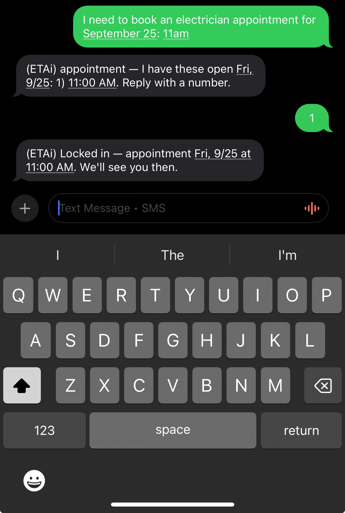
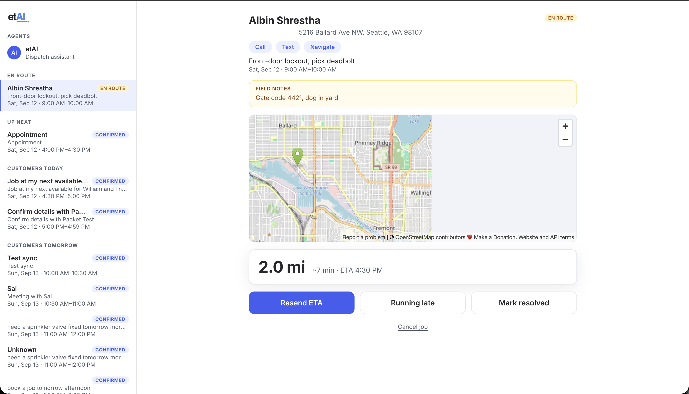
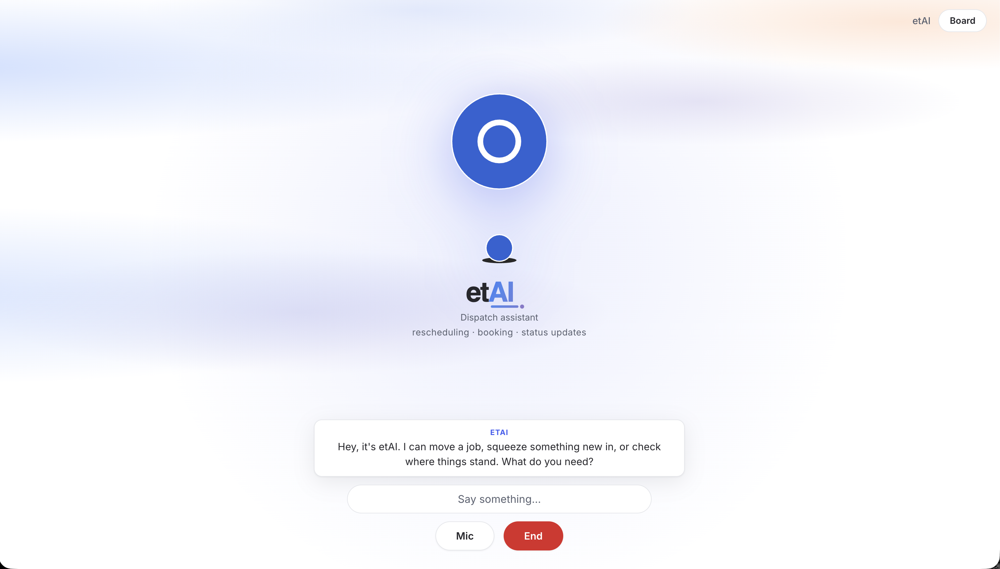

**etAI: AI dispatcher for the trades.**

**AI Tinkerers Seattle Hackathon 2026** · [Hackathon page](https://seattle.aitinkerers.org/hackathons/h_GfcjwcUkasM/teams) · [Ambiguous.ai](https://app.ambiguous.ai/settings)

## theme

Agents are leaving the chatbox. Build an agent for a place people
already work, talk, or live, then make it meaningfully more useful
because of that context. Put it into the web, mobile, Slack, Teams,
messaging, browsers, voice, wearables, robotics, or somewhere nobody
expects to find one yet. What becomes possible when the agent shows up
where the work is already happening?

A dispatcher you text. Contractors and clients book, reschedule, and
cancel appointments over iMessage, SMS, and calls; an Ambiguous.ai
workspace is the calendar of record. A FaceTime-style web app
(`frontend/`) lets users call their agent directly.

## demo

[click here for slides](https://htmlpreview.github.io/?https://github.com/randallwc/etai/blob/main/demo/index.html)





## layout

- `messaging/`: messaging service (iMessage/SMS in and out)
- `bus/`: the scheduling brain; answers texts via Ambiguous
- `calendar-agent/`: Ambiguous Assistant chat smoke script
- `frontend/`: the call-your-agent web app
- `shared/`: zero-dep helpers shared across services
- `models/`: JSON schemas for every wire shape
- `docs/`: all documentation

## docs

- [Architecture](docs/architecture.md): how messaging, the router, calendar integration, and call UI exchange data today and where the planned flow differs.
- [API](docs/API.md): agent endpoints, tools, data model, message flows, Ambiguous mapping, and operational gotchas.
- [Calendar contract](docs/CALENDAR.md): availability and event CRUD contract, errors, conformance checks, and calendar-provider options.
- [Phone contract](docs/PHONE.md): normalized inbound-message and outbound-send boundary shared by messaging consumers.
- [Bus service](docs/bus.md): bus-core modules, HTTP routes, intent handling, state, and voice-turn behavior.
- [Messaging service](docs/messaging.md): running the phone service, transports, subscriptions, mail polling, configuration, and iMessage caveats.
- [Calendar agent](docs/calendar-agent.md): direct MCP calendar integration, strict booking/rescheduling inputs, and Assistant timeout tradeoffs.
- [Calendar notifications](docs/notifications.md): reminder polling through the bus to contractor texts, including delivery and dedup behavior.
- [Ambiguous integration](docs/ambiguous-integration.md): verified workspace endpoints, authentication, frontend use, platform limitations, and rejected approaches.
- [External integrations](docs/INTEGRATIONS.md): integration map and the single Ambiguous boundary owned by each component.
- [Frontend](docs/frontend.md): call-your-agent UI flow, offline behavior, implementation ideas, and roadmap.
- [Setup](docs/setup.md): workspace provisioning, CLI authentication, Make targets, demo command, tests, and hooks.
- [Logo explorations](docs/logo/index.html): preview page for the ETAi wordmark and icon variants.

## quick start

```bash
cd frontend && npm install && npm run dev   # see docs/frontend.md
node messaging/index.js                     # see docs/messaging.md
node bus/index.js                         # see docs/bus.md
```
