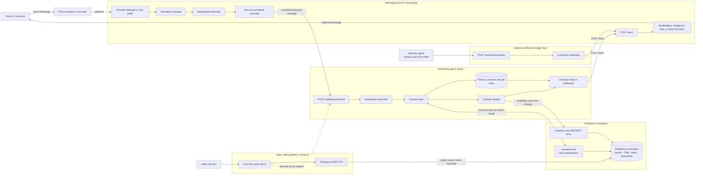
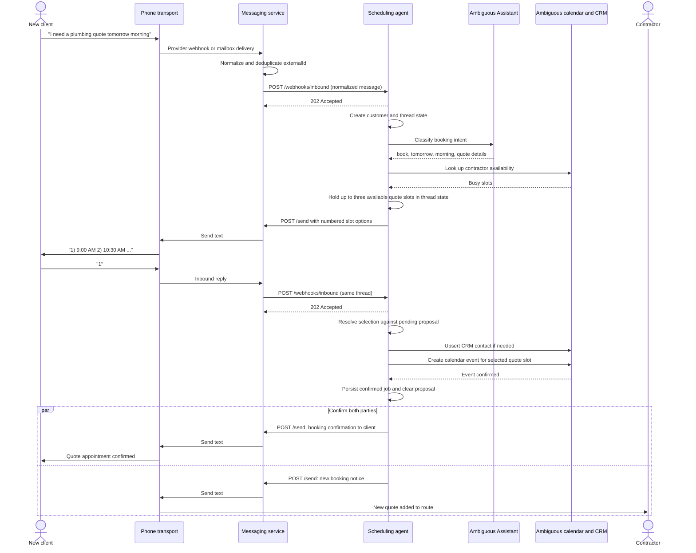
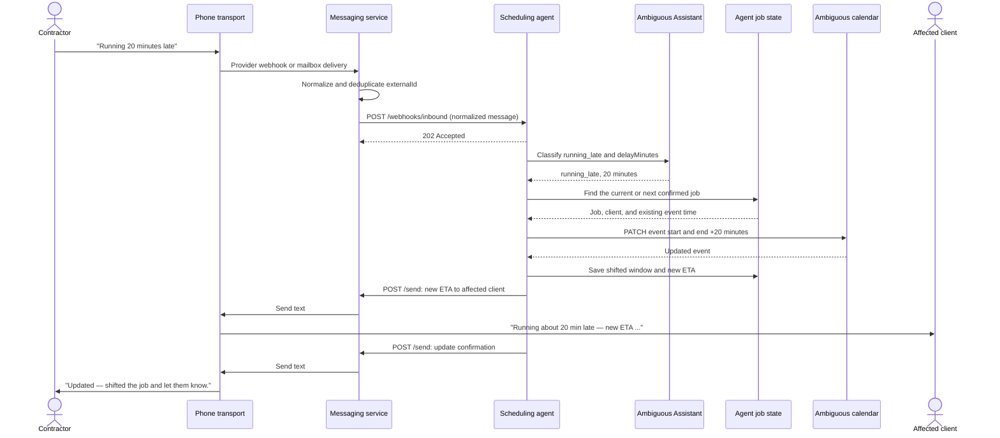

# ETAi architecture

ETAi lets clients schedule, reschedule, and cancel contractor appointments by message. Contractors can also use the video call UI. The agent service is the one scheduling brain on the live text path: it interprets a request, keeps booking state, and uses Ambiguous as the calendar and CRM system of record.

## Sequence: new client schedules a quote

## Sequence: contractor reports they are running late

## Components

### Messaging service

`messaging/` owns inbound and outbound channels, but no scheduling logic. An inbound provider webhook or mailbox delivery is normalized into `channel`, `from`, `body`, `externalId`, `receivedAt`, and `threadKey`; it is deduplicated by `externalId` and delivered to subscribers. The live subscription target is the agent's `POST /webhooks/inbound` endpoint.

Callers send replies through `POST /send` with `to`, `body`, and `threadKey`. The service selects BlueBubbles when configured, otherwise its stdout simulator. See `docs/PHONE.md` and `docs/messaging.md`.

### Scheduling agent

`agent/` receives normalized messages through `POST /webhooks/inbound`, deduplicates them again, and processes them asynchronously. It owns per-thread pending proposals, customer and job records, intent classification, calendar actions, and message replies. Client-originated changes also notify the contractor; contractor-originated changes notify the affected client.

### Ambiguous workspace and calendar adapter

`agent/calendar.js` exposes availability, day listing, create, update, and cancel operations to the scheduling loop. It calls Ambiguous through `agent/ambiguous.js`, the only backend file that fetches Ambiguous. Without an API key, the adapter uses an in-memory calendar so the same workflow can run offline.

The Ambiguous workspace is the system of record for events, CRM, tasks, and documents. Its Assistant returns a structured intent for each message; the agent loop—not the Assistant—then selects available slots and makes calendar changes. `calendar-agent/` remains a smoke-script and calendar-notification integration.

### Optional notification bridge

`bus/` is not subscribed to live inbound messages; subscribing both `bus/` and `agent/` would produce duplicate answers. It may receive calendar notifications at `POST /webhooks/calendar` from `calendar-agent/notify.js` and text the contractor through the messaging service.

### Video calling UI

`frontend/` currently calls the Ambiguous REST API directly from the browser. It makes scheduling requests into calendar events, turns other requests into tasks, and stores finished-call transcripts as workspace documents. The intended path routes video prose through the agent so all requests share one scheduling workflow.

## Data paths

The live message path is client or contractor → phone transport → messaging → agent → Ambiguous. Replies travel agent → messaging → selected transport → client or contractor. Messaging and the agent both deduplicate inbound messages by `externalId`.

The UI path is currently video call UI → Ambiguous REST API → workspace. The dashed edge in the diagram is planned only: video call UI → agent → Ambiguous.

## Ownership and operational notes

Contractors own schedules and travel to job sites. Clients message to book, reschedule, or cancel. Contractors receive daily summaries in their chosen channel; clients receive arrival, delay, cancellation, and reschedule notifications.

Message deduplication is best-effort: the messaging service keeps `externalId` values in memory, so a restart can accept a duplicate once. The agent also deduplicates receipt before it starts its asynchronous loop.

The Assistant chat endpoint needs verification against the active workspace before new work relies on it. Some docs and `calendar-agent/test.js` use `POST /api/assistant/chat`, while the live OpenAPI catalog previously did not list that path. The workspace specification is authoritative.

## Design decisions

The bus must not parse scheduling intent. That would create a second scheduling agent that can disagree with the live agent loop. The scheduling agent owns meaning, slot proposals, and calendar decisions.

A direct messaging-to-calendar connection was rejected because stateful booking proposals, notifications, and future enrichment need one owner. Browser-side MCP and the Ambiguous CLI were also rejected for the UI: MCP is a tool-calling transport unsuitable for a browser-held key, and the CLI shells out for each call; plain REST is used instead.

## Related documents

See `docs/INTERFACES.md` for component ownership and environment variables, `docs/API.md` for bus endpoints and tools, `docs/CALENDAR.md` for the calendar contract, `docs/PHONE.md` for the messaging contract, `docs/GOAL.md` for product framing, and `README.md` for MVP scope.
